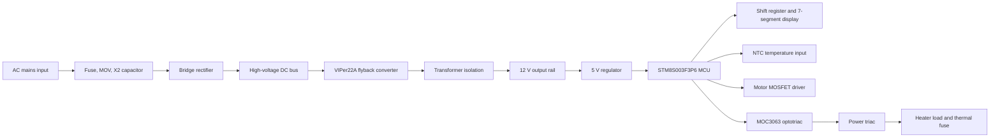

# Architecture

The design separates high-voltage power conversion, low-voltage control, sensing, user interface, and AC load switching.

## Control Flow

1. The offline SMPS generates an isolated low-voltage rail for the controller.
2. The STM8 controller reads temperature feedback through the NTC input network.
3. Display outputs are multiplexed through a serial shift register and digit driver transistors.
4. Heater enable is isolated through the optotriac before driving the power triac.
5. Motor output is handled separately through a low-side MOSFET and flyback diode.
6. Any invalid temperature state or over-temperature condition should force heater output off and latch a fault until recovery policy is satisfied.

## Design Intent

The public architecture emphasizes cost-aware redesign while keeping major safety boundaries visible: isolated power conversion, separated sensing/control logic, optically isolated AC switching, and thermal protection in the load path.
